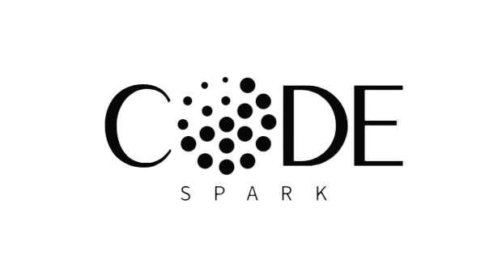

# Team-18
 

# Student Dropout Prediction Project

## Table of Contents
- [Introduction](#introduction)
- [Features](#features)
- [Getting Started](#getting-started)
  - [Prerequisites](#prerequisites)
  - [Installation](#installation)
- [Usage](#usage)
- [Credits](#usage)

## Introduction

Welcome to the Student Dropout Project! This project aims to address the critical issue of student dropouts in educational institutions. Our goal is to develop tools and resources that can help educators, administrators, and policymakers better understand and mitigate student dropout rates.

The model will be trained on a dataset of 
- Student data, 
- Dncluding academic performance, 
- Demographic information,
- Attendance records

### Why Student Dropout Matters

Our model  is to predict whether a student is at risk of dropping out. 
Student dropout rates have significant social and economic implications. By identifying and addressing the factors leading to dropouts, we can improve educational outcomes and create a brighter future for students.
*The model will then be used to predict the probability of a student dropping out, and this information can be used to intervene early and prevent dropout.*

## Features

- **Data Collection:** Gather and analyze relevant data to understand dropout trends.
- **Predictive Models:** Develop machine learning models to predict potential dropouts.
- **Intervention Strategies:** Implement strategies to prevent dropouts and support at-risk students.
- **Visualization:** Create visualizations to communicate insights effectively.
- **Reporting:** Generate reports and dashboards for stakeholders.

## Getting Started

Follow these instructions to get the project up and running on your local machine.

### Prerequisites

- [List any prerequisites or system requirements here]

### Installation

1. 
2. 

## Usage

[how to use your project, including code examples, configuration options, and any other relevant details.]

## Credits

This project was developed by  **Team CodeSpark**

- [Suchismita Behera] (https://github.com/suchismita004).
- [Ritika Kumari Gupta] (https://github.com/RitikaGupta02).
- [Ujjwal Kumar] (https://github.com/Codeioholic).
- [Sangram Keshari Pattnaik] (https://github.com/sangrampattnaik2003).
- [Ritika Kumari] (https://github.com/Ri-ti-ka).
- [Kajol Murmu] (https://github.com/Kajol-m).

